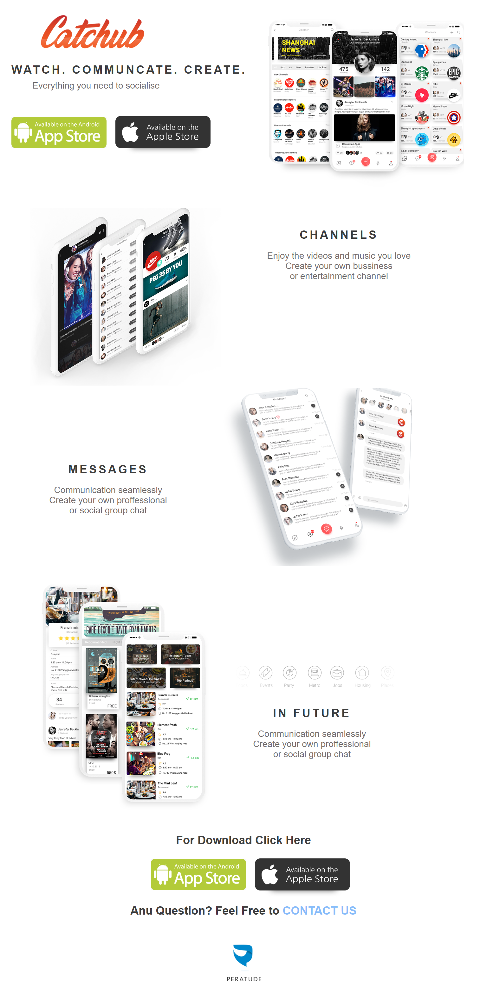

# Catchub Landing Page UI

This project is a landing page UI created using HTML and CSS.
The design is inspired by a mobile app promotion website and focuses on a
clean, soft, and modern layout.

## Features
- Clean and minimal UI
- Soft background colors
- App showcase layout
- Download section with app store buttons
- Smooth visual spacing and alignment

## Technologies Used
- HTML5
- CSS3

## Purpose
This project was created for practice to improve frontend development skills
and to learn how to recreate professional UI designs using HTML and CSS.

## Design Reference
This UI is recreated from a reference design for learning purposes only.
All credits for the original design go to the respective designers.

## Screenshot

## Author
Roshaan Jadoon
